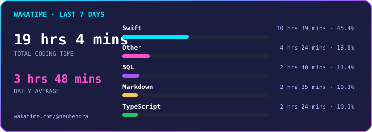

<h1 align="center">Hendra Irawan</h1>

<p align="center">
  <strong>Full-stack developer · design enthusiast · indie maker</strong><br />
  <sub>Native apps · developer tools · playful AI products</sub>
</p>

<p align="center">
  
  
  
  
  
</p>

## `hendra@github:~$ whoami`

I’m **Hendra Irawan**, a developer who enjoys building thoughtful software from the first product idea to the experience people use every day.

I work across native macOS apps, web projects, and small developer tools—with a particular interest in useful AI, expressive interaction, and polished product details.

## `hendra@github:~$ dashboard --live`

<p align="center">
  <a href="https://github.com/HendraaaIrwn">
    
  </a>
  <a href="https://github.com/HendraaaIrwn">
    
  </a>
</p>

<p align="center">
  <a href="https://github.com/HendraaaIrwn?tab=repositories">
    
  </a>
  <a href="https://github.com/HendraaaIrwn">
    
  </a>
</p>

<p align="center">
  <sub>Live GitHub metrics for activity, consistency, and public languages.</sub>
</p>

## `hendra@github:~$ cat about.txt`

```text
I turn practical ideas into focused, human-centered software.

Current lens: product thinking, clear interfaces, and software that respects
people’s attention and privacy.
```

## `hendra@github:~$ cat current-focus.txt`

- Building native experiences with Swift, SwiftUI, and AppKit
- Exploring AI and retrieval-augmented products with a practical use case
- Making developer tools and playful command-line experiences
- Growing as an indie maker with strong product and interaction design instincts

## `hendra@github:~$ ls ~/featured-projects`

[`Milo/`](https://github.com/HendraaaIrwn/Milo)  
**A tiny, local-first macOS coding companion.** Milo reacts to focus, helps with reminders and todos, and keeps coding metrics on-device.  
`Swift` · `SwiftUI` · `AppKit` · `Apple Intelligence`

[`Conductor/`](https://github.com/HendraaaIrwn/Conductor)  
**An ambient railway journey for the terminal.** An original ASCII animation with configurable scenes, weather, color modes, and reduced-motion support.  
`Go` · `CLI` · `Terminal UI`

[`GameJam2/`](https://github.com/HendraaaIrwn/GameJam2)  
**An experimental Swift game made for a game jam.** A small exploration of interaction, play, and surprising mechanics.  
`Swift` · `Game Development`

More public work lives in [my repositories](https://github.com/HendraaaIrwn?tab=repositories).

## `hendra@github:~$ tech --list`

```text
Native development
├── Swift
├── SwiftUI
└── AppKit

Web development
├── TypeScript
└── Astro

Tools and experimentation
├── Go
├── Terminal applications
└── AI / RAG product exploration
```

## `hendra@github:~$ wakatime --last-7-days --live`

<p align="center">
  <a href="https://wakatime.com/@neuhendra">
    
  </a>
</p>

<p align="center">
  <a href="https://wakatime.com/@neuhendra">
    
  </a>
</p>

## `hendra@github:~$ git graph --contributions --live`

<p align="center">
  <a href="https://github.com/HendraaaIrwn">
    
  </a>
</p>

## `hendra@github:~$ git log --activity --follow`

<!--RECENT_ACTIVITY:start-->
- ⭐ Starred [addyosmani/agent-skills](https://github.com/addyosmani/agent-skills)
- ⬆️ Pushed 1 commit to [HendraaaIrwn/HendraaaIrwn](https://github.com/HendraaaIrwn/HendraaaIrwn)
- 📦 Created branch in [HendraaaIrwn/HendraaaIrwn](https://github.com/HendraaaIrwn/HendraaaIrwn)
- ⬆️ Pushed 1 commit to [HendraaaIrwn/HendraaaIrwn](https://github.com/HendraaaIrwn/HendraaaIrwn)
- ⬆️ Pushed 1 commit to [HendraaaIrwn/HendraaaIrwn](https://github.com/HendraaaIrwn/HendraaaIrwn)
<!--RECENT_ACTIVITY:end-->

<!--RECENT_ACTIVITY:last_update-->
<sub>Last synced 30 Aug 2026, 23:45 · Asia/Jakarta</sub>
<!--RECENT_ACTIVITY:last_update_end-->

## `hendra@github:~$ contact`

- GitHub: [@HendraaaIrwn](https://github.com/HendraaaIrwn)
- Collaboration: open an issue or discussion in the repository you’d like to talk about

<!-- Add a verified personal website, LinkedIn URL, or email link here when available. -->

## `hendra@github:~$ _`
